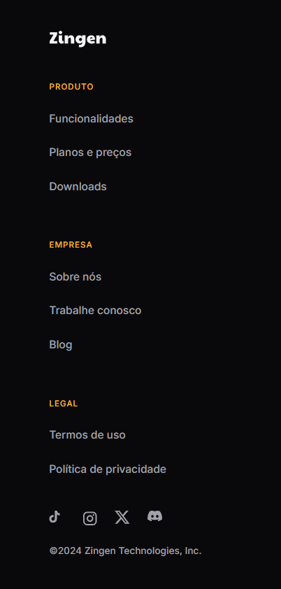

# Zingen - Singing App Landing Page

This project is a fully responsive and engaging landing page for "Zingen", a conceptual application designed to make singing easy and fun. The page features a dark-mode theme, compelling call-to-action buttons, and a clear structure that guides the user through the app's features and plans. A major focus of this project was ensuring the layout adapts seamlessly to different screen sizes, providing an optimal user experience on both desktop and mobile devices.

## ✨ Technologies Used

## 🚀 Live Demo
****

---

## 🖥️ Desktop Showcase
*The user experience as seen on a desktop computer. Click on the images to see the project live.*

**1. Hero Section:** *The main view with the core value proposition: "Singing has never been so easy."*

**2. Meet the App:** *An introduction to the Zingen app and its mission.*

**3. Features:** *Detailing the main functionalities available to the user.*

**4. Plans & Pricing:** *Displaying the different subscription tiers and their benefits.*

**5. Download Section:** *The final call-to-action, encouraging users to download the app.*

---

## 📱 Mobile Version Showcase
*The same clean and intuitive experience, optimized for mobile screens.*

